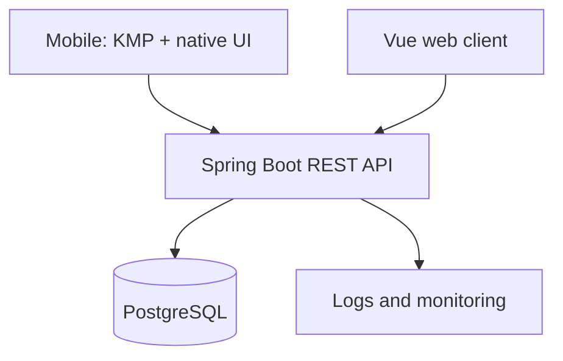

# Architecture

## System context

Palette Platform is a monorepo containing independently deployable clients and a modular-monolith backend.



## Backend layering

Each feature package follows a vertical-slice structure while preserving clear responsibilities:

```text
feature/
├── api/             controllers and HTTP DTOs
├── application/     use cases and transaction boundaries
├── domain/          business rules and domain types
└── infrastructure/  JPA entities and repository adapters
```

Dependency direction is inward: HTTP and persistence depend on application/domain contracts. Domain code does not depend on Spring MVC.

## Initial modules

- `identity`: users, credentials, JWT access tokens, refresh-token rotation
- `palette`: palettes, ordered colors, tags, publishing state
- `favorite`: idempotent favorite operations and personal collections
- `moderation`: administrative decisions and audit trail
- `shared`: error contracts, clock/ID abstractions, pagination conventions

## Important decisions

### Monorepo

One repository reduces coordination overhead and permits an API change to update clients and contract tests atomically. CI remains path-scoped so unrelated applications are not rebuilt unnecessarily.

### Modular monolith

The domain is too small to justify distributed transactions, network boundaries, or duplicated deployment infrastructure. Feature boundaries are retained so modules can be extracted later if evidence requires it.

### PostgreSQL as the integration-test database

H2 is allowed only for a fast application-context smoke test. Repository behavior and migrations must be verified against PostgreSQL with Testcontainers.

### Native mobile UI with KMP sharing

Networking, serialization, domain models, and repositories can be shared. Android uses Compose and iOS uses SwiftUI so the project demonstrates both KMP and platform-native development.

## API conventions

- Base path: `/api/v1`
- JSON uses camelCase
- UUIDs are opaque strings to clients
- Times use ISO-8601 UTC
- Collection endpoints are paginated
- Idempotency is preferred for favorite/unfavorite and logout operations
- Errors use one consistent problem-details shape
